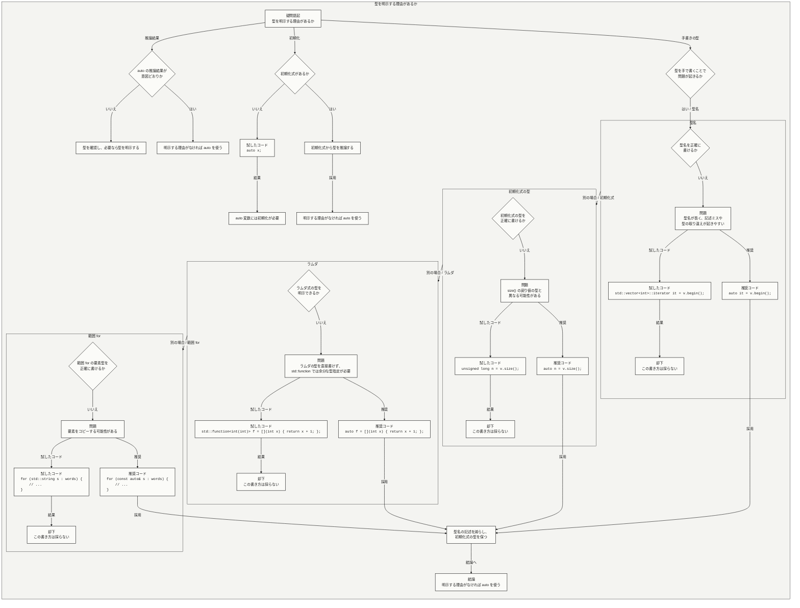

# 型を明示する理由がなければ auto を使う

```mermaid
%%{init: {'theme':'base','themeCSS':'svg { background-color: #f4f4f1; }','flowchart':{'htmlLabels':true,'wrappingWidth':720},'themeVariables':{'background':'#f4f4f1','primaryColor':'#fbfbf8','primaryTextColor':'#1a1a1a','primaryBorderColor':'#1a1a1a','lineColor':'#1a1a1a','secondaryColor':'#fbfbf8','tertiaryColor':'#fbfbf8','textColor':'#1a1a1a','mainBkg':'#fbfbf8','nodeBorder':'#1a1a1a','edgeLabelBackground':'#f4f4f1','nodeTextColor':'#1a1a1a','clusterBkg':'#f4f4f1','clusterBorder':'#1a1a1a','titleColor':'#1a1a1a'}}}%%
flowchart TD
    classDef default fill:#fbfbf8,stroke:#1a1a1a,stroke-width:1.5px,color:#1a1a1a
    linkStyle default stroke:#1a1a1a,stroke-width:1.5px,color:#1a1a1a
    subgraph canvas ["型を明示する理由があるか"]
        direction TD
        open["疑問提起<br/>型を明示する理由があるか"]
        open -- "手書きの型" --> hand{"型を手で書くことで<br/>問題が起きるか"}
        open -- "推論結果" --> deduced{"auto の推論結果が<br/>意図どおりか"}
        deduced -- "いいえ" --> dedStop["型を確認し、必要なら型を明示する"]
        deduced -- "はい" --> dedConclusion["明示する理由がなければ auto を使う"]
        open -- "初期化" --> hasInit{"初期化式があるか"}
        hasInit -- "いいえ" --> bareTried["試したコード<br/><pre style='text-align:left; display:block; width:100%; margin:0'><code>auto x;</code></pre>"]
        bareTried -- "結果" --> bareStop["auto 変数には初期化が必要"]
        hasInit -- "はい" --> deduceNode["初期化式から型を推論する"]
        deduceNode -- "採用" --> initConclusion["明示する理由がなければ auto を使う"]

        subgraph nameCase ["型名"]
            direction TD
            nameQ{"型名を正確に<br/>書けるか"}
            nameQ -- "いいえ" --> nameProblem["問題<br/>型名が長く、記述ミスや<br/>型の取り違えが起きやすい"]
            nameProblem -- "試したコード" --> nameTried["試したコード<br/><pre style='text-align:left; display:block; width:100%; margin:0'><code>std::vector&lt;int&gt;::iterator it = v.begin();</code></pre>"]
            nameTried -- "結果" --> nameRejected["却下<br/>この書き方は採らない"]
            nameProblem -- "推奨" --> nameGood["推奨コード<br/><pre style='text-align:left; display:block; width:100%; margin:0'><code>auto it = v.begin();</code></pre>"]
        end
        subgraph initCase ["初期化式の型"]
            direction TD
            initTypeQ{"初期化式の型を<br/>正確に書けるか"}
            initTypeQ -- "いいえ" --> initTypeProblem["問題<br/>size() の戻り値の型と<br/>異なる可能性がある"]
            initTypeProblem -- "試したコード" --> initTypeTried["試したコード<br/><pre style='text-align:left; display:block; width:100%; margin:0'><code>unsigned long n = v.size();</code></pre>"]
            initTypeTried -- "結果" --> initTypeRejected["却下<br/>この書き方は採らない"]
            initTypeProblem -- "推奨" --> initTypeGood["推奨コード<br/><pre style='text-align:left; display:block; width:100%; margin:0'><code>auto n = v.size();</code></pre>"]
        end
        subgraph lambdaCase ["ラムダ"]
            direction TD
            lambdaQ{"ラムダ式の型を<br/>明示できるか"}
            lambdaQ -- "いいえ" --> lambdaProblem["問題<br/>ラムダの型を直接書けず、<br/>std::function では余分な型指定が必要"]
            lambdaProblem -- "試したコード" --> lambdaTried["試したコード<br/><pre style='text-align:left; display:block; width:100%; margin:0'><code>std::function&lt;int(int)&gt; f = [](int x) { return x + 1; };</code></pre>"]
            lambdaTried -- "結果" --> lambdaRejected["却下<br/>この書き方は採らない"]
            lambdaProblem -- "推奨" --> lambdaGood["推奨コード<br/><pre style='text-align:left; display:block; width:100%; margin:0'><code>auto f = [](int x) { return x + 1; };</code></pre>"]
        end
        subgraph rangeCase ["範囲 for"]
            direction TD
            rangeQ{"範囲 for の要素型を<br/>正確に書けるか"}
            rangeQ -- "いいえ" --> rangeProblem["問題<br/>要素をコピーする可能性がある"]
            rangeProblem -- "試したコード" --> rangeTried["試したコード<br/><pre style='text-align:left; display:block; width:100%; margin:0'><code>for (std::string s : words) {<br/>    // ...<br/>}</code></pre>"]
            rangeTried -- "結果" --> rangeRejected["却下<br/>この書き方は採らない"]
            rangeProblem -- "推奨" --> rangeGood["推奨コード<br/><pre style='text-align:left; display:block; width:100%; margin:0'><code>for (const auto&amp; s : words) {<br/>    // ...<br/>}</code></pre>"]
        end

        hand -- "はい / 型名" --> nameQ
        nameCase -- "別の場合 / 初期化式" --> initCase
        initCase -- "別の場合 / ラムダ" --> lambdaCase
        lambdaCase -- "別の場合 / 範囲 for" --> rangeCase
        nameGood -- "採用" --> reason["型名の記述を減らし、<br/>初期化式の型を保つ"]
        initTypeGood -- "採用" --> reason
        lambdaGood -- "採用" --> reason
        rangeGood -- "採用" --> reason
        reason -- "結論へ" --> conclusion["結論<br/>明示する理由がなければ auto を使う"]
    end
    style canvas fill:#f4f4f1,stroke:#1a1a1a,color:#1a1a1a
```
