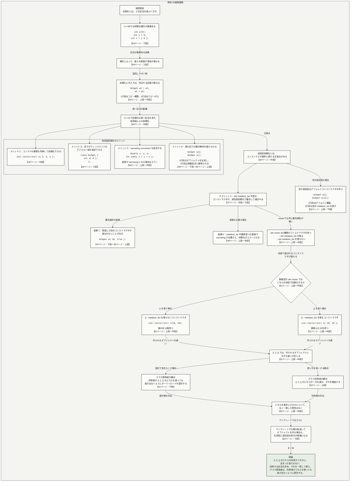

# 初期化は、() や = ではなく {} を使用する

```mermaid
%%{init: {'theme':'base','securityLevel':'loose','themeCSS':'svg { background-color: #f4f4f1; } foreignObject div, .label div { text-align: left !important; justify-content: flex-start !important; } .nodeLabel, .nodeLabel p, .nodeLabel span, .nodeLabel div, .edgeLabel, .edgeLabel span, .edgeLabel p, .edgeLabel tspan, .label { color: #1a1a1a !important; fill: #1a1a1a !important; } .nodeLabel { display: block !important; width: 100% !important; text-align: left !important; } .nodeLabel p, .nodeLabel span, .nodeLabel div { text-align: left !important; } .edgeLabel { background-color: #f4f4f1 !important; } .edgeLabel rect, .labelBkg { fill: #f4f4f1 !important; background-color: #f4f4f1 !important; } .cluster rect { fill: #f4f4f1 !important; } .nodeLabel pre { display: block; width: 100%; margin: 0; text-align: left; background: transparent; border: 0; } .nodeLabel code { color: #1a1a1a !important; background-color: #d2d2d2 !important; display: block; width: 100%; margin: 0; text-align: left; white-space: pre-wrap; font-family: Consolas, monospace; }','flowchart':{'htmlLabels':true,'wrappingWidth':520,'padding':12,'nodeSpacing':32,'rankSpacing':40},'themeVariables':{'background':'#f4f4f1','primaryColor':'#fbfbf8','primaryTextColor':'#1a1a1a','primaryBorderColor':'#1a1a1a','lineColor':'#1a1a1a','secondaryColor':'#fbfbf8','tertiaryColor':'#fbfbf8','textColor':'#1a1a1a','mainBkg':'#fbfbf8','nodeBorder':'#1a1a1a','edgeLabelBackground':'#f4f4f1','nodeTextColor':'#1a1a1a','clusterBkg':'#f4f4f1','clusterBorder':'#1a1a1a','titleColor':'#1a1a1a','fontSize':'16px'}}}%%
flowchart TD
    classDef default fill:#fbfbf8,stroke:#1a1a1a,stroke-width:1.5px,color:#1a1a1a
    classDef claim fill:#e7efe4,stroke:#1a1a1a,stroke-width:1.5px,color:#1a1a1a
    linkStyle default stroke:#1a1a1a,color:#1a1a1a
    subgraph canvas ["項目7の論理展開"]
        direction TD

        open["疑問提起<br/>初期化には、どの記法を選ぶべきか"]
        multi["C++98では初期化構文が複数ある<pre><code>int x(0);<br/>int y = 0;<br/>int z = { 0 };</code></pre>【43ページ・下段】"]
        diff["構文によって、使える場面や意味が異なる<br/>【44ページ・上段】"]
        assign["初期化と代入では、呼ばれる処理が異なる<pre><code>Widget w2 = w1;<br/>w1 = w2;</code></pre>1行目はコピー構築、2行目はコピー代入<br/>【44ページ・上段〜中段】"]
        unify["C++11で初期化の統一記法を導入<br/>波括弧による初期化<br/>【44ページ・中段】"]

        subgraph benefits ["波括弧初期化のメリット"]
            direction TD
            benefit1["メリット①：コンテナの要素を列挙して初期化できる<pre><code>std::vector&lt;int&gt; v{ 1, 3, 5 };</code></pre>【44ページ・中段】"]
            benefit2["メリット②：非スタティックメンバの<br/>デフォルト値を指定できる<pre><code>class Widget {<br/>  int x{ 0 };<br/>};</code></pre>【44ページ・下段】"]
            benefit3["メリット③：narrowing conversion を拒否する<pre><code>double x, y, z;<br/>int sum1{ x + y + z };</code></pre>変換が narrowing になる場合はエラー<br/>【45ページ・上段〜中段】"]
            benefit4["メリット④：最も厄介な構文解析を避けられる<pre><code>Widget w{};<br/>Widget w();</code></pre>1行目はオブジェクトを生成し、<br/>2行目は関数宣言と解釈される<br/>【45ページ・下段〜46ページ・上段】"]
        end

        warn["波括弧初期化には、<br/>コンストラクタ選択に関する注意点がある<br/>【46ページ・中段】"]
        initList["デメリット①：std::initializer_list を取る<br/>コンストラクタが、波括弧初期化で優先して選ばれる<br/>【47ページ・中段〜下段】"]
        result1["結果①：意図した別のコンストラクタが<br/>選ばれないことがある<pre><code>Widget w{ 10, true };</code></pre>【47ページ・下段〜49ページ・上段】"]
        result2["結果②：initializer_list の要素型への変換で<br/>narrowing が必要だと、初期化がエラーになる<br/>【49ページ・上段〜中段】"]
        empty["空の波括弧はデフォルトコンストラクタを呼ぶ<pre><code>Widget w{};<br/>Widget w({});</code></pre>1行目はデフォルト構築、<br/>2行目は空の initializer_list を渡す<br/>【50ページ・上段〜下段】"]

        vectorCtor["std::vector は2種類のコンストラクタを持つ<br/>・std::initializer_list を取る<br/>・std::initializer_list を取らない<br/>【51ページ・上段〜中段】"]
        choice{"数値型の std::vector では<br/>どちらの括弧で初期化するか<br/>【51ページ・上段〜中段】"}
        paren["()：initializer_list を取らないコンストラクタ<pre><code>std::vector&lt;int&gt; v(10, 20);</code></pre>値20を10個持つ<br/>【51ページ・上段〜中段】"]
        brace["{}：initializer_list を取るコンストラクタ<pre><code>std::vector&lt;int&gt; v{ 10, 20 };</code></pre>要素10と20を持つ<br/>【51ページ・上段〜中段】"]

        diffResult["() と {} では、作られるオブジェクトに<br/>大きな違いが生じる<br/>【51ページ・上段〜中段】"]
        developer["クラス開発者の観点<br/>利用者が () と {} のどちらを使っても<br/>差が出ないようにオーバーロードを設計する<br/>【51ページ・下段】"]
        userSide["クラス利用者の観点<br/>() と {} のどちらか一方を選び、それを徹底する<br/>【52ページ・上段】"]
        consensus["どちらを基本にするかについて、<br/>広く一致した意見はない<br/>【52ページ・上段〜中段】"]
        templateCase["テンプレートで引数を転送して<br/>オブジェクトを作る場合も、<br/>丸括弧と波括弧の両方が候補になる<br/>【52ページ・下段】"]
        conclusion["結論<br/>() と {} のどちらを採用すべきかに、<br/>定まった答えはない。<br/>採用する記法を決め、それを一貫して使う。<br/>クラス開発者は、利用者がどちらを使っても<br/>差が出ないように設計する。"]

        open --> multi
        multi -->|"記法が複数ある結果"| diff
        diff -->|"混同しやすい例"| assign
        assign -->|"統一記法の動機"| unify

        unify --> benefit1
        unify --> benefit2
        unify --> benefit3
        unify --> benefit4

        unify -->|"注意点"| warn
        warn --> initList
        initList -->|"優先選択の結果"| result1
        initList -->|"変換が必要な場合"| result2
        warn -->|"空の波括弧の場合"| empty

        initList -->|"vectorでも同じ優先規則が働く"| vectorCtor
        vectorCtor -->|"括弧で選ばれるコンストラクタが変わる"| choice
        choice -- "() を使う場合" --> paren
        choice -- "{} を使う場合" --> brace

        paren -->|"作られるオブジェクトの違い"| diffResult
        brace -->|"作られるオブジェクトの違い"| diffResult
        diffResult -->|"設計で差をなくす観点"| developer
        diffResult -->|"使い方を統一する観点"| userSide
        developer -->|"設計側の対応"| consensus
        userSide -->|"利用側の対応"| consensus
        consensus -->|"テンプレートではさらに"| templateCase
        templateCase -->|"まとめ"| conclusion
    end
    style canvas fill:#f4f4f1,stroke:#1a1a1a,color:#1a1a1a
    class conclusion claim
```
