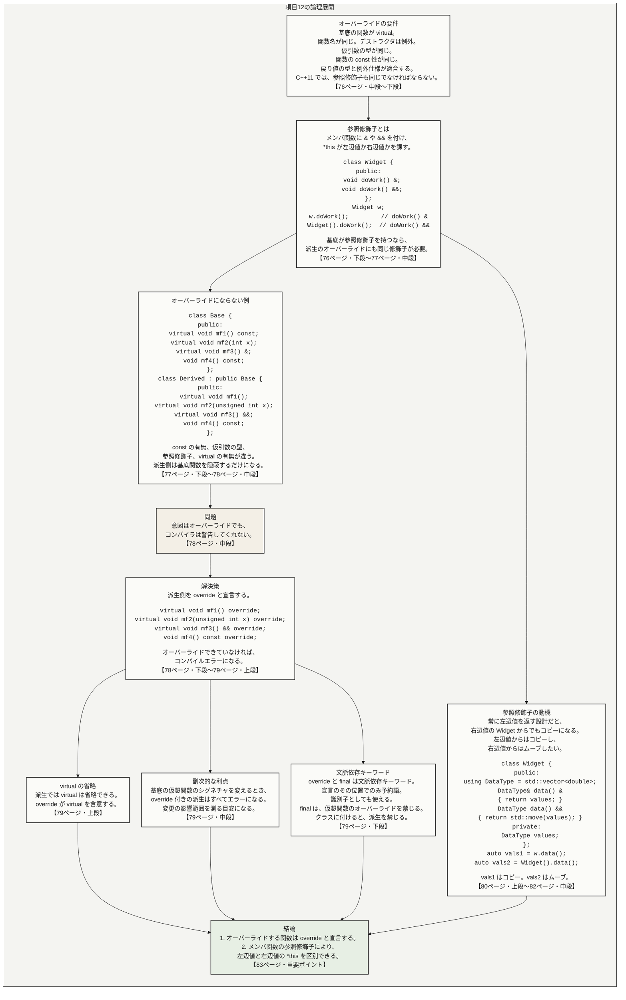

# オーバーライドする関数は override と宣言する

```mermaid
%%{init: {'theme':'base','securityLevel':'loose','themeCSS':'svg { background-color: #f4f4f1; } foreignObject div, .label div { text-align: left !important; justify-content: flex-start !important; } .nodeLabel, .nodeLabel p, .nodeLabel span, .nodeLabel div, .edgeLabel, .edgeLabel span, .edgeLabel p, .edgeLabel tspan, .label { color: #1a1a1a !important; fill: #1a1a1a !important; } .nodeLabel { display: block !important; width: 100% !important; text-align: left !important; } .nodeLabel p, .nodeLabel span, .nodeLabel div { text-align: left !important; } .nodeLabel .nodeTitle { display: block !important; width: 100% !important; text-align: center !important; font-weight: 700 !important; margin: 0 0 0.4em 0; } .edgeLabel { background-color: #f4f4f1 !important; } .edgeLabel rect, .labelBkg { fill: #f4f4f1 !important; background-color: #f4f4f1 !important; } .cluster rect { fill: #f4f4f1 !important; } .nodeLabel pre { display: block; width: 100%; margin: 0; text-align: left; background: transparent; border: 0; } .nodeLabel code { color: #1a1a1a !important; background-color: #d2d2d2 !important; display: block; width: 100%; margin: 0; text-align: left; white-space: pre-wrap; font-family: Consolas, monospace; }','flowchart':{'htmlLabels':true,'wrappingWidth':520,'padding':12,'nodeSpacing':32,'rankSpacing':40},'themeVariables':{'background':'#f4f4f1','primaryColor':'#fbfbf8','primaryTextColor':'#1a1a1a','primaryBorderColor':'#1a1a1a','lineColor':'#1a1a1a','secondaryColor':'#fbfbf8','tertiaryColor':'#fbfbf8','textColor':'#1a1a1a','mainBkg':'#fbfbf8','nodeBorder':'#1a1a1a','edgeLabelBackground':'#f4f4f1','nodeTextColor':'#1a1a1a','clusterBkg':'#f4f4f1','clusterBorder':'#1a1a1a','titleColor':'#1a1a1a','fontSize':'16px'}}}%%
flowchart TD
    classDef default fill:#fbfbf8,stroke:#1a1a1a,stroke-width:1.5px,color:#1a1a1a
    classDef stop fill:#f3efe6,stroke:#1a1a1a,stroke-width:1.5px,color:#1a1a1a
    classDef claim fill:#e7efe4,stroke:#1a1a1a,stroke-width:1.5px,color:#1a1a1a
    linkStyle default stroke:#1a1a1a,color:#1a1a1a
    subgraph canvas ["項目12の論理展開"]
        direction TD

        req["<div class='nodeTitle'>オーバーライドの要件</div>基底の関数が virtual。<br/>関数名が同じ。デストラクタは例外。<br/>仮引数の型が同じ。<br/>関数の const 性が同じ。<br/>戻り値の型と例外仕様が適合する。<br/>C++11 では、参照修飾子も同じでなければならない。<br/>【76ページ・中段〜下段】"]
        refIntro["<div class='nodeTitle'>参照修飾子とは</div>メンバ関数に &amp; や &amp;&amp; を付け、<br/>*this が左辺値か右辺値かを課す。<pre><code>class Widget {<br/>public:<br/>  void doWork() &amp;;<br/>  void doWork() &amp;&amp;;<br/>};<br/>Widget w;<br/>w.doWork();         // doWork() &amp;<br/>Widget().doWork();  // doWork() &amp;&amp;</code></pre>基底が参照修飾子を持つなら、<br/>派生のオーバーライドにも同じ修飾子が必要。<br/>【76ページ・下段〜77ページ・中段】"]
        mismatch["<div class='nodeTitle'>オーバーライドにならない例</div><pre><code>class Base {<br/>public:<br/>  virtual void mf1() const;<br/>  virtual void mf2(int x);<br/>  virtual void mf3() &amp;;<br/>  void mf4() const;<br/>};<br/>class Derived : public Base {<br/>public:<br/>  virtual void mf1();<br/>  virtual void mf2(unsigned int x);<br/>  virtual void mf3() &amp;&amp;;<br/>  void mf4() const;<br/>};</code></pre>const の有無、仮引数の型、<br/>参照修飾子、virtual の有無が違う。<br/>派生側は基底関数を隠蔽するだけになる。<br/>【77ページ・下段〜78ページ・中段】"]
        nowarn["<div class='nodeTitle'>問題</div>意図はオーバーライドでも、<br/>コンパイラは警告してくれない。<br/>【78ページ・中段】"]
        solution["<div class='nodeTitle'>解決策</div>派生側を override と宣言する。<pre><code>virtual void mf1() override;<br/>virtual void mf2(unsigned int x) override;<br/>virtual void mf3() &amp;&amp; override;<br/>void mf4() const override;</code></pre>オーバーライドできていなければ、<br/>コンパイルエラーになる。<br/>【78ページ・下段〜79ページ・上段】"]
        virtualOpt["<div class='nodeTitle'>virtual の省略</div>派生では virtual は省略できる。<br/>override が virtual を含意する。<br/>【79ページ・上段】"]
        impact["<div class='nodeTitle'>副次的な利点</div>基底の仮想関数のシグネチャを変えるとき、<br/>override 付きの派生はすべてエラーになる。<br/>変更の影響範囲を測る目安になる。<br/>【79ページ・中段】"]
        keyword["<div class='nodeTitle'>文脈依存キーワード</div>override と final は文脈依存キーワード。<br/>宣言のその位置でのみ予約語。<br/>識別子としても使える。<br/>final は、仮想関数のオーバーライドを禁じる。<br/>クラスに付けると、派生を禁じる。<br/>【79ページ・下段】"]
        refWhy["<div class='nodeTitle'>参照修飾子の動機</div>常に左辺値を返す設計だと、<br/>右辺値の Widget からでもコピーになる。<br/>左辺値からはコピーし、<br/>右辺値からはムーブしたい。<pre><code>class Widget {<br/>public:<br/>  using DataType = std::vector&lt;double&gt;;<br/>  DataType&amp; data() &amp;<br/>  { return values; }<br/>  DataType data() &amp;&amp;<br/>  { return std::move(values); }<br/>private:<br/>  DataType values;<br/>};<br/>auto vals1 = w.data();<br/>auto vals2 = Widget().data();</code></pre>vals1 はコピー。vals2 はムーブ。<br/>【80ページ・上段〜82ページ・中段】"]
        conclusion["<div class='nodeTitle'>結論</div>1. オーバーライドする関数は override と宣言する。<br/>2. メンバ関数の参照修飾子により、<br/>左辺値と右辺値の *this を区別できる。<br/>【83ページ・重要ポイント】"]

        req --> refIntro --> mismatch --> nowarn --> solution
        refIntro --> refWhy
        solution --> virtualOpt
        solution --> impact
        solution --> keyword
        virtualOpt --> conclusion
        impact --> conclusion
        keyword --> conclusion
        refWhy --> conclusion
    end
    style canvas fill:#f4f4f1,stroke:#1a1a1a,color:#1a1a1a
    class nowarn stop
    class conclusion claim
```
