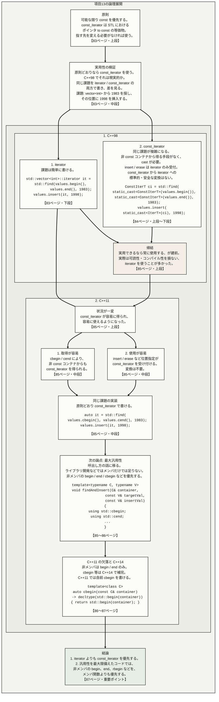

# iterator よりも const_iterator を優先する

```mermaid
%%{init: {'theme':'base','securityLevel':'loose','themeCSS':'svg { background-color: #f4f4f1; } foreignObject div, .label div { text-align: left !important; justify-content: flex-start !important; } .nodeLabel, .nodeLabel p, .nodeLabel span, .nodeLabel div, .edgeLabel, .edgeLabel span, .edgeLabel p, .edgeLabel tspan, .label { color: #1a1a1a !important; fill: #1a1a1a !important; } .nodeLabel { display: block !important; width: 100% !important; text-align: left !important; } .nodeLabel p, .nodeLabel span, .nodeLabel div { text-align: left !important; } .nodeLabel .nodeTitle { display: block !important; width: 100% !important; text-align: center !important; font-weight: 700 !important; margin: 0 0 0.4em 0; } .edgeLabel { background-color: #f4f4f1 !important; } .edgeLabel rect, .labelBkg { fill: #f4f4f1 !important; background-color: #f4f4f1 !important; } .cluster rect { fill: #f4f4f1 !important; } .nodeLabel pre { display: block; width: 100%; margin: 0; text-align: left; background: transparent; border: 0; } .nodeLabel code { color: #1a1a1a !important; background-color: #d2d2d2 !important; display: block; width: 100%; margin: 0; text-align: left; white-space: pre-wrap; font-family: Consolas, monospace; } .edgePath .path, .flowchart-link, path.path { stroke: #1a1a1a !important; stroke-width: 2.75px !important; } .arrowheadPath, marker path { fill: #1a1a1a !important; stroke: #1a1a1a !important; }','flowchart':{'htmlLabels':true,'wrappingWidth':400,'padding':12,'nodeSpacing':28,'rankSpacing':48},'themeVariables':{'background':'#f4f4f1','primaryColor':'#fbfbf8','primaryTextColor':'#1a1a1a','primaryBorderColor':'#1a1a1a','lineColor':'#1a1a1a','secondaryColor':'#fbfbf8','tertiaryColor':'#fbfbf8','textColor':'#1a1a1a','mainBkg':'#fbfbf8','nodeBorder':'#1a1a1a','edgeLabelBackground':'#f4f4f1','nodeTextColor':'#1a1a1a','clusterBkg':'#f4f4f1','clusterBorder':'#1a1a1a','titleColor':'#1a1a1a','fontSize':'16px'}}}%%
flowchart TD
    classDef default fill:#fbfbf8,stroke:#1a1a1a,stroke-width:1.5px,color:#1a1a1a
    classDef stop fill:#f3efe6,stroke:#1a1a1a,stroke-width:1.5px,color:#1a1a1a
    classDef claim fill:#e7efe4,stroke:#1a1a1a,stroke-width:1.5px,color:#1a1a1a
    linkStyle default stroke:#1a1a1a,stroke-width:2.75px,color:#1a1a1a

    subgraph canvas ["項目13の論理展開"]
        direction TD

        principle["<div class='nodeTitle'>原則</div>可能な限り const を優先する。<br/>const_iterator は STL における<br/>ポインタ to const の等価物。<br/>指す先を変える必要がなければ使う。<br/>【83ページ・上段】"]
        verify["<div class='nodeTitle'>実用性の検証</div>原則どおりなら const_iterator を使う。<br/>C++98 でそれは現実的か。<br/>同じ課題を iterator / const_iterator の<br/>両方で書き、差を見る。<br/>課題: vector&lt;int&gt; から 1983 を探し、<br/>その位置に 1998 を挿入する。<br/>【83ページ・中段】"]

        subgraph compare [" "]
            direction LR

            subgraph era98 ["1. C++98"]
                direction TB
                cpp98iter["<div class='nodeTitle'>1. iterator</div>課題は簡単に書ける。<pre><code>std::vector&lt;int&gt;::iterator it =<br/>  std::find(values.begin(),<br/>            values.end(), 1983);<br/>values.insert(it, 1998);</code></pre>【83ページ・下段】"]
                cpp98citer["<div class='nodeTitle'>2. const_iterator</div>同じ課題が複雑になる。<br/>非 const コンテナから得る手段がなく、<br/>cast が必要。<br/>insert / erase は iterator のみ受付。<br/>const_iterator から iterator への<br/>標準的・安全な変換はない。<pre><code>ConstIterT ci = std::find(<br/>  static_cast&lt;ConstIterT&gt;(values.begin()),<br/>  static_cast&lt;ConstIterT&gt;(values.end()),<br/>  1983);<br/>values.insert(<br/>  static_cast&lt;IterT&gt;(ci), 1998);</code></pre>【84ページ・上段〜下段】"]
                cpp98verdict["<div class='nodeTitle'>帰結</div>実用できるなら常に使用する、が建前。<br/>実際は可読性・コンパイル性を損ない、<br/>iterator を使うことが多かった。<br/>【85ページ・上段】"]
                cpp98iter --> cpp98verdict
                cpp98citer --> cpp98verdict
            end

            subgraph era11 ["2. C++11"]
                direction TB
                cpp11easy["<div class='nodeTitle'>状況が一変</div>const_iterator が容易に得られ、<br/>容易に使えるようになった。<br/>【85ページ・上段】"]
                getEasy["<div class='nodeTitle'>1. 取得が容易</div>cbegin / cend により、<br/>非 const コンテナからも<br/>const_iterator を得られる。<br/>【85ページ・中段】"]
                useEasy["<div class='nodeTitle'>2. 使用が容易</div>insert / erase など位置指定が<br/>const_iterator を受け付ける。<br/>変換は不要。<br/>【85ページ・中段】"]
                cpp11code["<div class='nodeTitle'>同じ課題の実装</div>原則どおり const_iterator で書ける。<pre><code>auto it = std::find(<br/>  values.cbegin(), values.cend(), 1983);<br/>values.insert(it, 1998);</code></pre>【85ページ・中段】"]
                nonMember["<div class='nodeTitle'>次の論点: 最大汎用性</div>呼出し方の話に移る。<br/>ライブラリ開発などではメンバだけでは足りない。<br/>非メンバの begin / end / cbegin などを優先する。<pre><code>template&lt;typename C, typename V&gt;<br/>void findAndInsert(C&amp; container,<br/>                   const V&amp; targetVal,<br/>                   const V&amp; insertVal)<br/>{<br/>  using std::cbegin;<br/>  using std::cend;<br/>  ...<br/>}</code></pre>【85〜86ページ】"]
                cpp14["<div class='nodeTitle'>C++11 の欠落と C++14</div>非メンバは begin / end のみ。<br/>cbegin 等は C++14 で補完。<br/>C++11 では自前 cbegin を書ける。<pre><code>template&lt;class C&gt;<br/>auto cbegin(const C&amp; container)<br/>  -&gt; decltype(std::begin(container))<br/>{ return std::begin(container); }</code></pre>【86〜87ページ】"]
                cpp11easy --> getEasy
                cpp11easy --> useEasy
                getEasy --> cpp11code
                useEasy --> cpp11code
                cpp11code --> nonMember --> cpp14
            end

            cpp98iter ~~~ cpp11easy
        end

        conclusion["<div class='nodeTitle'>結論</div>1. iterator よりも const_iterator を優先する。<br/>2. 汎用性を最大限備えたコードでは、<br/>非メンバの begin、end、rbegin などを、<br/>メンバ関数よりも優先する。<br/>【87ページ・重要ポイント】"]

        principle --> verify
        verify --> cpp98iter
        verify --> cpp98citer
        cpp98verdict --> cpp11easy
        cpp14 --> conclusion
    end

    style canvas fill:#f4f4f1,stroke:#1a1a1a,stroke-width:1.5px,color:#1a1a1a
    style compare fill:#ecece6,stroke:#1a1a1a,stroke-width:1.5px,color:#1a1a1a
    style era98 fill:#f4f4f1,stroke:#1a1a1a,stroke-width:1.5px,color:#1a1a1a
    style era11 fill:#f4f4f1,stroke:#1a1a1a,stroke-width:1.5px,color:#1a1a1a
    class cpp98verdict stop
    class conclusion claim
```
