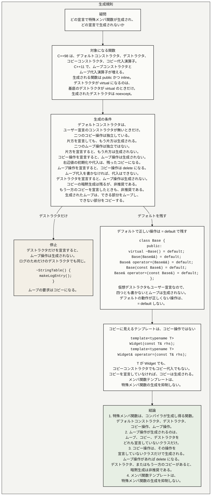

# 自動的に生成される特殊メンバ関数を理解する

```mermaid
%%{init: {'theme':'base','securityLevel':'loose','themeCSS':'svg { background-color: #f4f4f1; } .nodeLabel, .nodeLabel p, .nodeLabel span, .nodeLabel div, .edgeLabel, .edgeLabel span, .edgeLabel p, .edgeLabel tspan, .label { color: #1a1a1a !important; fill: #1a1a1a !important; } .nodeLabel { display: block !important; width: 100% !important; text-align: left !important; } .nodeLabel p, .nodeLabel span, .nodeLabel div { text-align: left !important; } .edgeLabel { background-color: #f4f4f1 !important; } .edgeLabel rect, .labelBkg { fill: #f4f4f1 !important; background-color: #f4f4f1 !important; } .cluster rect { fill: #f4f4f1 !important; } .nodeLabel pre { display: block; width: 100%; margin: 0; text-align: left; background: transparent; border: 0; } .nodeLabel code { color: #1a1a1a !important; background-color: #d2d2d2 !important; display: block; width: 100%; margin: 0; text-align: left; white-space: pre-wrap; font-family: Consolas, monospace; }','flowchart':{'htmlLabels':true,'wrappingWidth':520,'padding':12,'nodeSpacing':32,'rankSpacing':40},'themeVariables':{'background':'#f4f4f1','primaryColor':'#fbfbf8','primaryTextColor':'#1a1a1a','primaryBorderColor':'#1a1a1a','lineColor':'#1a1a1a','secondaryColor':'#fbfbf8','tertiaryColor':'#fbfbf8','textColor':'#1a1a1a','mainBkg':'#fbfbf8','nodeBorder':'#1a1a1a','edgeLabelBackground':'#f4f4f1','nodeTextColor':'#1a1a1a','clusterBkg':'#f4f4f1','clusterBorder':'#1a1a1a','titleColor':'#1a1a1a','fontSize':'16px'}}}%%
flowchart TD
    classDef default fill:#fbfbf8,stroke:#1a1a1a,stroke-width:1.5px,color:#1a1a1a
    classDef stop fill:#f3efe6,stroke:#1a1a1a,stroke-width:1.5px,color:#1a1a1a
    classDef claim fill:#e7efe4,stroke:#1a1a1a,stroke-width:1.5px,color:#1a1a1a
    linkStyle default stroke:#1a1a1a,color:#1a1a1a
    subgraph canvas ["生成規則"]
        direction TB

        open["疑問<br/>どの宣言で特殊メンバ関数が生成され、<br/>どの宣言で生成されないか"]
        funcs["対象になる関数<br/>C++98 は、デフォルトコンストラクタ、デストラクタ、<br/>コピーコンストラクタ、コピー代入演算子。<br/>C++11 で、ムーブコンストラクタと<br/>ムーブ代入演算子が増える。<br/>生成される関数は public かつ inline。<br/>デストラクタが virtual になるのは、<br/>基底のデストラクタが virtual のときだけ。<br/>生成されたデストラクタは noexcept。"]
        rules["生成の条件<br/>デフォルトコンストラクタは、<br/>ユーザー宣言のコンストラクタが無いときだけ。<br/>二つのコピー操作は独立している。<br/>片方を宣言しても、もう片方は生成される。<br/>二つのムーブ操作は独立ではない。<br/>片方を宣言すると、もう片方は生成されない。<br/>コピー操作を宣言すると、ムーブ操作は生成されない。<br/>右辺値の初期化や代入は、残ったコピーになる。<br/>ムーブ操作を宣言すると、コピー操作は delete になる。<br/>ムーブ代入を書かなければ、代入はできない。<br/>デストラクタを宣言すると、ムーブ操作は生成されない。<br/>コピーの暗黙生成は残るが、非推奨である。<br/>もう一方のコピーを宣言したときも、非推奨である。<br/>生成されたムーブは、できる部分をムーブし、<br/>できない部分をコピーする。"]
        stopDtor["停止<br/>デストラクタだけを宣言すると、<br/>ムーブ操作は生成されない。<br/>ログのためだけのデストラクタでも同じ。<pre><code>~StringTable() {<br/>  makeLogEntry();<br/>}</code></pre>ムーブの要求はコピーになる。"]
        practice["デフォルトで正しい操作は = default で残す<pre><code>class Base {<br/>  public:<br/>    virtual ~Base() = default;<br/>    Base(Base&amp;&amp;) = default;<br/>    Base&amp; operator=(Base&amp;&amp;) = default;<br/>    Base(const Base&amp;) = default;<br/>    Base&amp; operator=(const Base&amp;) = default;<br/>};</code></pre>仮想デストラクタもユーザー宣言なので、<br/>四つとも書かないとムーブは生成されない。<br/>デフォルトの動作が正しくない操作は、<br/>= default しない。"]
        tpl["コピーに見えるテンプレートは、コピー操作ではない<pre><code>template&lt;typename T&gt;<br/>Widget(const T&amp; rhs);<br/>template&lt;typename T&gt;<br/>Widget&amp; operator=(const T&amp; rhs);</code></pre>T が Widget でも、<br/>コピーコンストラクタでもコピー代入でもない。<br/>コピーを宣言していなければ、コピーは生成される。<br/>メンバ関数テンプレートは、<br/>特殊メンバ関数の生成を抑制しない。"]
        conclusion["結論<br/>1. 特殊メンバ関数は、コンパイラが生成し得る関数。<br/>デフォルトコンストラクタ、デストラクタ、<br/>コピー操作、ムーブ操作。<br/>2. ムーブ操作が生成されるのは、<br/>ムーブ、コピー、デストラクタを<br/>どれも宣言していないクラスだけ。<br/>3. コピー操作は、その操作を<br/>宣言していないクラスだけで生成される。<br/>ムーブ操作があれば delete になる。<br/>デストラクタ、またはもう一方のコピーがあると、<br/>暗黙生成は非推奨である。<br/>4. メンバ関数テンプレートは、<br/>特殊メンバ関数の生成を抑制しない。"]

        open --> funcs --> rules
        rules -->|"デストラクタだけ"| stopDtor
        rules -->|"デフォルトを残す"| practice
        practice --> tpl --> conclusion
    end
    style canvas fill:#f4f4f1,stroke:#1a1a1a,color:#1a1a1a
    class stopDtor stop
    class conclusion claim
```
