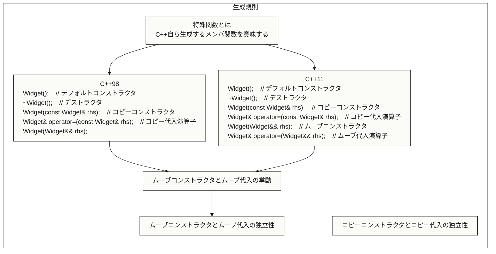
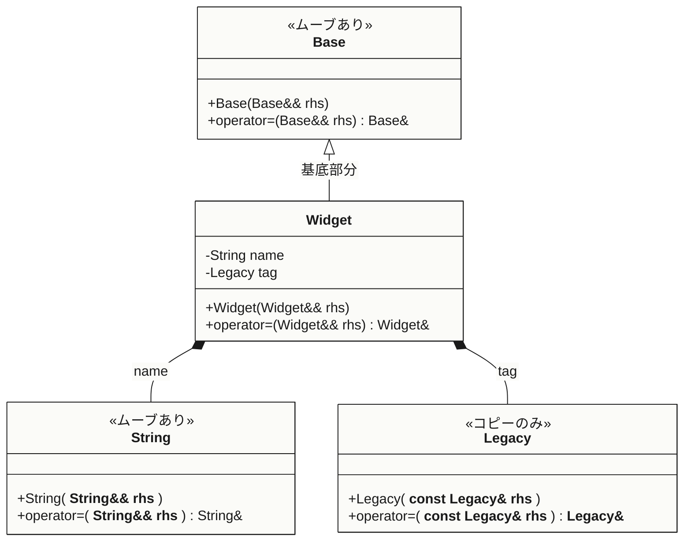
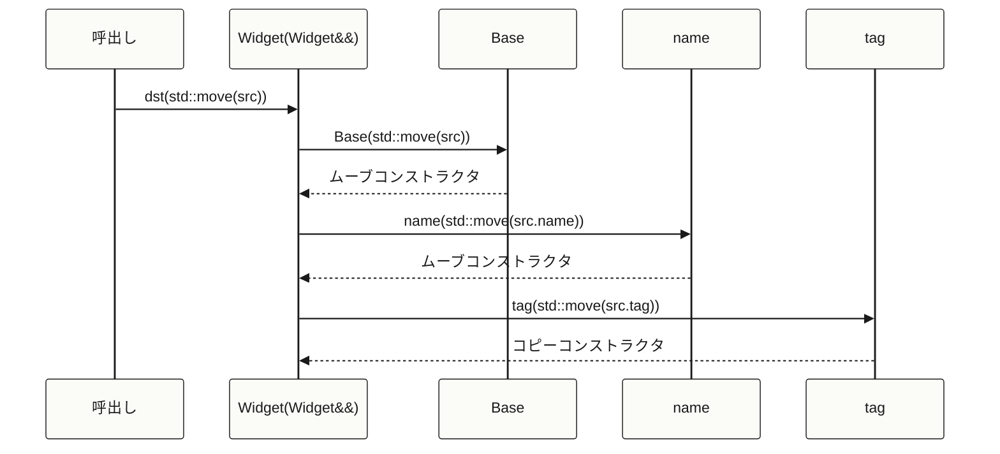
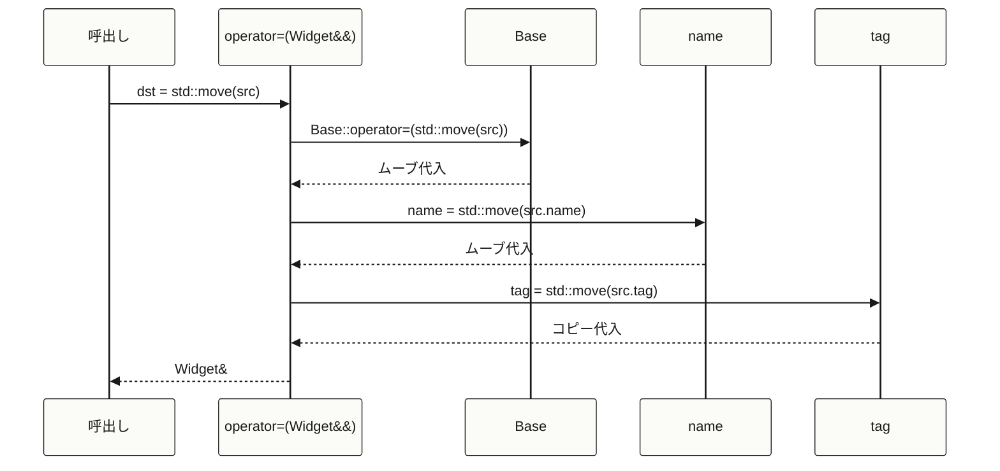

# 自動的に生成される特殊メンバ関数を理解する

```mermaid
%%{init: {'theme':'base','securityLevel':'loose','htmlLabels':true,'themeCSS':'strong, b, tspan[font-weight=bold] { color: #ff7070 !important; fill: #ff7070 !important; } svg, foreignObject, foreignObject div, .nodeLabel { color-scheme: light dark; } svg { background-color: transparent; } .nodeLabel { display: block !important; } .node rect, .node polygon, .node circle, .classGroup rect, rect.actor { fill: var(--vscode-editorWidget-background, light-dark(#fbfbf8, #2a2a27)) !important; stroke: var(--vscode-editor-foreground, light-dark(#1a1a1a, #e4e0d6)) !important; stroke-width: 1.5px !important; } .nodeLabel, .nodeLabel p, .nodeLabel span, .nodeLabel div, .label, .edgeLabel, .edgeLabel span, .edgeLabel p, .edgeLabel tspan, .edgeLabel text, .cluster-label, .cluster-label span, .cluster-label div, foreignObject, foreignObject div, foreignObject p, foreignObject span, .classGroup text, .classTitleText, .classText, .stereotypeText, text.actor, .messageText, .labelText, .loopText, .noteText, tspan { color: var(--vscode-editor-foreground, light-dark(#1a1a1a, #f3f1ea)) !important; fill: var(--vscode-editor-foreground, light-dark(#1a1a1a, #f3f1ea)) !important; } .edgeLabel { background-color: var(--vscode-editor-background, light-dark(#f4f4f1, #1c1c1a)) !important; } .edgeLabel rect, .labelBkg { fill: var(--vscode-editor-background, light-dark(#f4f4f1, #1c1c1a)) !important; } .cluster rect { fill: transparent !important; stroke: var(--vscode-editor-foreground, light-dark(#1a1a1a, #e4e0d6)) !important; stroke-width: 1.5px !important; } .edgePath .path, .flowchart-link, .relationshipLine, path.relation, .messageLine0, .messageLine1, .actor-line, .classGroup line { stroke: var(--vscode-editor-foreground, light-dark(#1a1a1a, #e4e0d6)) !important; fill: none !important; } .arrowheadPath, marker path, marker polygon { fill: var(--vscode-editor-foreground, light-dark(#1a1a1a, #e4e0d6)) !important; stroke: var(--vscode-editor-foreground, light-dark(#1a1a1a, #e4e0d6)) !important; } .nodeLabel pre { display: block; margin: 0; text-align: left; background: transparent; border: 0; } .nodeLabel code { color: var(--vscode-editor-foreground, light-dark(#1a1a1a, #f3f1ea)) !important; background-color: var(--vscode-textCodeBlock-background, light-dark(#e0ded8, #3d3d38)) !important; display: block; margin: 0; text-align: left; white-space: pre-wrap; font-family: Consolas, monospace; } .note { fill: var(--vscode-editorWidget-background, light-dark(#f3efe6, #34342f)) !important; stroke: var(--vscode-editor-foreground, light-dark(#1a1a1a, #e4e0d6)) !important; }','flowchart':{'htmlLabels':true,'wrappingWidth':900,'padding':12,'nodeSpacing':32,'rankSpacing':40},'themeVariables':{'background':'transparent','primaryColor':'#fbfbf8','primaryTextColor':'#1a1a1a','primaryBorderColor':'#1a1a1a','lineColor':'#1a1a1a','secondaryColor':'#f4f4f1','tertiaryColor':'#f4f4f1','textColor':'#1a1a1a','mainBkg':'#fbfbf8','nodeBorder':'#1a1a1a','edgeLabelBackground':'#f4f4f1','nodeTextColor':'#1a1a1a','clusterBkg':'transparent','clusterBorder':'#1a1a1a','titleColor':'#1a1a1a','fontSize':'16px','actorBkg':'#fbfbf8','actorBorder':'#1a1a1a','actorTextColor':'#1a1a1a','actorLineColor':'#1a1a1a','signalColor':'#1a1a1a','signalTextColor':'#1a1a1a'}}}%%
flowchart TD
    subgraph canvas ["生成規則"]
        direction TB
        SpecialMemberFunc["特殊関数とは<br/>C++自ら生成するメンバ関数を意味する"]
        SpecialMemberFunc98["<div style='text-align:center !important'>C++98</div><div style='text-align:left !important;white-space:pre'>Widget();    // デフォルトコンストラクタ<br/>~Widget();    // デストラクタ<br/>Widget(const Widget&amp; rhs);    // コピーコンストラクタ<br/>Widget&amp; operator=(const Widget&amp; rhs);    // コピー代入演算子<br/>Widget(Widget&amp;&amp; rhs);</div>"]
        SpecialMemberFunc11["<div style='text-align:center !important'>C++11</div><div style='text-align:left !important;white-space:pre'>Widget();    // デフォルトコンストラクタ<br/>~Widget();    // デストラクタ<br/>Widget(const Widget&amp; rhs);    // コピーコンストラクタ<br/>Widget&amp; operator=(const Widget&amp; rhs);    // コピー代入演算子<br/>Widget(Widget&amp;&amp; rhs);    // ムーブコンストラクタ<br/>Widget&amp; operator=(Widget&amp;&amp; rhs);    // ムーブ代入演算子</div>"]
        MoveByMember["ムーブコンストラクタとムーブ代入の挙動"]
        IndependencyOfCopy["コピーコンストラクタとコピー代入の独立性"]
        IndependencyOfMove["ムーブコンストラクタとムーブ代入の独立性"]

        SpecialMemberFunc --> SpecialMemberFunc98 --> MoveByMember --> IndependencyOfMove
        SpecialMemberFunc --> SpecialMemberFunc11 --> MoveByMember
    end
```

### クラス図は、ムーブの対象になる部分を並べたものです。

```mermaid
%%{init: {'theme':'base','securityLevel':'loose','htmlLabels':false,'themeCSS':'strong, b, tspan[font-weight=bold] { color: #ff7070 !important; fill: #ff7070 !important; } svg, foreignObject, foreignObject div, .nodeLabel { color-scheme: light dark; } svg { background-color: transparent; } .node rect, .node polygon, .node circle, .classGroup rect, rect.actor { fill: var(--vscode-editorWidget-background, light-dark(#fbfbf8, #2a2a27)) !important; stroke: var(--vscode-editor-foreground, light-dark(#1a1a1a, #e4e0d6)) !important; stroke-width: 1.5px !important; } .nodeLabel, .nodeLabel p, .nodeLabel span, .nodeLabel div, .label, .edgeLabel, .edgeLabel span, .edgeLabel p, .edgeLabel tspan, .edgeLabel text, .cluster-label, .cluster-label span, .cluster-label div, foreignObject, foreignObject div, foreignObject p, foreignObject span, .classGroup text, .classTitleText, .classText, .stereotypeText, text.actor, .messageText, .labelText, .loopText, .noteText, tspan { color: var(--vscode-editor-foreground, light-dark(#1a1a1a, #f3f1ea)) !important; fill: var(--vscode-editor-foreground, light-dark(#1a1a1a, #f3f1ea)) !important; } .edgeLabel { background-color: var(--vscode-editor-background, light-dark(#f4f4f1, #1c1c1a)) !important; } .edgeLabel rect, .labelBkg { fill: var(--vscode-editor-background, light-dark(#f4f4f1, #1c1c1a)) !important; } .cluster rect { fill: transparent !important; stroke: var(--vscode-editor-foreground, light-dark(#1a1a1a, #e4e0d6)) !important; stroke-width: 1.5px !important; } .edgePath .path, .flowchart-link, .relationshipLine, path.relation, .messageLine0, .messageLine1, .actor-line, .classGroup line { stroke: var(--vscode-editor-foreground, light-dark(#1a1a1a, #e4e0d6)) !important; fill: none !important; } .arrowheadPath, marker path, marker polygon { fill: var(--vscode-editor-foreground, light-dark(#1a1a1a, #e4e0d6)) !important; stroke: var(--vscode-editor-foreground, light-dark(#1a1a1a, #e4e0d6)) !important; } .note { fill: var(--vscode-editorWidget-background, light-dark(#f3efe6, #34342f)) !important; stroke: var(--vscode-editor-foreground, light-dark(#1a1a1a, #e4e0d6)) !important; } g.edgeLabel foreignObject div, g.edgeLabel span.edgeLabel, span.edgeLabel, div.labelBkg { background-color: var(--vscode-editorWidget-background, light-dark(#fbfbf8, #2a2a27)) !important; color: var(--vscode-editor-foreground, light-dark(#1a1a1a, #f3f1ea)) !important; opacity: 1 !important; } g.edgeLabel rect, rect.background { fill: var(--vscode-editorWidget-background, light-dark(#fbfbf8, #2a2a27)) !important; stroke: var(--vscode-editor-foreground, light-dark(#1a1a1a, #e4e0d6)) !important; opacity: 1 !important; } g.edgeLabel text, g.edgeLabel tspan, .edgeLabel tspan { fill: var(--vscode-editor-foreground, light-dark(#1a1a1a, #f3f1ea)) !important; stroke: var(--vscode-editorWidget-background, light-dark(#fbfbf8, #2a2a27)) !important; stroke-width: 4px !important; paint-order: stroke fill !important; } path.outer-path, path.label-container, path.basic, .outer-path path, .label-container path, g.basic path, .node .outer-path path { fill: var(--vscode-editorWidget-background, light-dark(#fbfbf8, #2a2a27)) !important; stroke: var(--vscode-editor-foreground, light-dark(#1a1a1a, #e4e0d6)) !important; } .divider path, .neo-line path { fill: none !important; stroke: var(--vscode-editor-foreground, light-dark(#1a1a1a, #e4e0d6)) !important; stroke-width: 1.5px !important; } .annotation-group span, .label-group span, .members-group span, .methods-group span, .annotation-group div, .label-group div, .members-group div, .methods-group div { color: var(--vscode-editor-foreground, light-dark(#1a1a1a, #f3f1ea)) !important; fill: var(--vscode-editor-foreground, light-dark(#1a1a1a, #f3f1ea)) !important; opacity: 1 !important; } #compositionStart path, #compositionEnd path, #extensionStart path, #extensionEnd path, #aggregationStart path, #aggregationEnd path, #dependencyStart path, #dependencyEnd path { fill: var(--vscode-editor-foreground, light-dark(#1a1a1a, #e4e0d6)) !important; stroke: var(--vscode-editor-foreground, light-dark(#1a1a1a, #e4e0d6)) !important; } svg g.methods-group.text g.label foreignObject div span.nodeLabel.markdown-node-label p strong, svg g.methods-group.text g.label foreignObject div span.nodeLabel.markdown-node-label strong, svg g.methods-group.text g.label foreignObject div span.nodeLabel.markdown-node-label p b, svg g.methods-group.text g.label text tspan.text-inner-tspan[font-weight=bold] { color: #ff7070 !important; fill: #ff7070 !important; }','themeVariables':{'background':'transparent','primaryColor':'#fbfbf8','primaryTextColor':'#1a1a1a','primaryBorderColor':'#1a1a1a','lineColor':'#1a1a1a','textColor':'#1a1a1a','mainBkg':'#fbfbf8','nodeBorder':'#1a1a1a','edgeLabelBackground':'#f4f4f1','nodeTextColor':'#1a1a1a','titleColor':'#1a1a1a','fontSize':'16px'}}}%%
classDiagram
    class Base {
        <<ムーブあり>>
        +Base(Base&& rhs)
        +operator=(Base&& rhs) Base&
    }
    class String {
        <<ムーブあり>>
        +String(**String&& rhs**)
        +operator=(**String&& rhs**) String&
    }
    class Legacy {
        <<コピーのみ>>
        +Legacy(**const Legacy& rhs**)
        +operator=(**const Legacy& rhs**) __Legacy&__
    }
    class Widget {
        +Widget(Widget&& rhs)
        +operator=(Widget&& rhs) Widget&
        -String name
        -Legacy tag
    }
    Base <|-- Widget : 基底部分
    Widget *-- String : name
    Widget *-- Legacy : tag
```

### シーケンス図は、Widget dst(std::move(src)) でその部分を宣言順に初期化する流れです。

```mermaid
%%{init: {'theme':'base','securityLevel':'loose','htmlLabels':false,'themeCSS':'strong, b, tspan[font-weight=bold] { color: #ff7070 !important; fill: #ff7070 !important; } svg, foreignObject, foreignObject div, .nodeLabel { color-scheme: light dark; } svg { background-color: transparent; } .node rect, .node polygon, .node circle, .classGroup rect, rect.actor { fill: var(--vscode-editorWidget-background, light-dark(#fbfbf8, #2a2a27)) !important; stroke: var(--vscode-editor-foreground, light-dark(#1a1a1a, #e4e0d6)) !important; stroke-width: 1.5px !important; } .nodeLabel, .nodeLabel p, .nodeLabel span, .nodeLabel div, .label, .edgeLabel, .edgeLabel span, .edgeLabel p, .edgeLabel tspan, .edgeLabel text, .cluster-label, .cluster-label span, .cluster-label div, foreignObject, foreignObject div, foreignObject p, foreignObject span, .classGroup text, .classTitleText, .classText, .stereotypeText, text.actor, .messageText, .labelText, .loopText, .noteText, tspan { color: var(--vscode-editor-foreground, light-dark(#1a1a1a, #f3f1ea)) !important; fill: var(--vscode-editor-foreground, light-dark(#1a1a1a, #f3f1ea)) !important; } .edgeLabel { background-color: var(--vscode-editor-background, light-dark(#f4f4f1, #1c1c1a)) !important; } .edgeLabel rect, .labelBkg { fill: var(--vscode-editor-background, light-dark(#f4f4f1, #1c1c1a)) !important; } .cluster rect { fill: transparent !important; stroke: var(--vscode-editor-foreground, light-dark(#1a1a1a, #e4e0d6)) !important; stroke-width: 1.5px !important; } .edgePath .path, .flowchart-link, .relationshipLine, path.relation, .messageLine0, .messageLine1, .actor-line, .classGroup line { stroke: var(--vscode-editor-foreground, light-dark(#1a1a1a, #e4e0d6)) !important; fill: none !important; } .arrowheadPath, marker path, marker polygon { fill: var(--vscode-editor-foreground, light-dark(#1a1a1a, #e4e0d6)) !important; stroke: var(--vscode-editor-foreground, light-dark(#1a1a1a, #e4e0d6)) !important; } .note { fill: var(--vscode-editorWidget-background, light-dark(#f3efe6, #34342f)) !important; stroke: var(--vscode-editor-foreground, light-dark(#1a1a1a, #e4e0d6)) !important; }','themeVariables':{'background':'transparent','primaryColor':'#fbfbf8','primaryTextColor':'#1a1a1a','primaryBorderColor':'#1a1a1a','lineColor':'#1a1a1a','textColor':'#1a1a1a','mainBkg':'#fbfbf8','actorBkg':'#fbfbf8','actorBorder':'#1a1a1a','actorTextColor':'#1a1a1a','actorLineColor':'#1a1a1a','signalColor':'#1a1a1a','signalTextColor':'#1a1a1a','noteBkgColor':'#f3efe6','noteTextColor':'#1a1a1a','noteBorderColor':'#1a1a1a','fontSize':'16px'}}}%%
sequenceDiagram
    participant C as 呼出し
    participant W as Widget(Widget&&)
    participant B as Base
    participant N as name
    participant T as tag

    C->>W: dst(std::move(src))
    W->>B: Base(std::move(src))
    B-->>W: ムーブコンストラクタ
    W->>N: name(std::move(src.name))
    N-->>W: ムーブコンストラクタ
    W->>T: tag(std::move(src.tag))
    T-->>W: コピーコンストラクタ
```

### ムーブ代入 dst = std::move(src) も同じ順です。呼ばれるのは各部分の代入演算子です。

```mermaid
%%{init: {'theme':'base','securityLevel':'loose','htmlLabels':false,'themeCSS':'strong, b, tspan[font-weight=bold] { color: #ff7070 !important; fill: #ff7070 !important; } svg, foreignObject, foreignObject div, .nodeLabel { color-scheme: light dark; } svg { background-color: transparent; } .node rect, .node polygon, .node circle, .classGroup rect, rect.actor { fill: var(--vscode-editorWidget-background, light-dark(#fbfbf8, #2a2a27)) !important; stroke: var(--vscode-editor-foreground, light-dark(#1a1a1a, #e4e0d6)) !important; stroke-width: 1.5px !important; } .nodeLabel, .nodeLabel p, .nodeLabel span, .nodeLabel div, .label, .edgeLabel, .edgeLabel span, .edgeLabel p, .edgeLabel tspan, .edgeLabel text, .cluster-label, .cluster-label span, .cluster-label div, foreignObject, foreignObject div, foreignObject p, foreignObject span, .classGroup text, .classTitleText, .classText, .stereotypeText, text.actor, .messageText, .labelText, .loopText, .noteText, tspan { color: var(--vscode-editor-foreground, light-dark(#1a1a1a, #f3f1ea)) !important; fill: var(--vscode-editor-foreground, light-dark(#1a1a1a, #f3f1ea)) !important; } .edgeLabel { background-color: var(--vscode-editor-background, light-dark(#f4f4f1, #1c1c1a)) !important; } .edgeLabel rect, .labelBkg { fill: var(--vscode-editor-background, light-dark(#f4f4f1, #1c1c1a)) !important; } .cluster rect { fill: transparent !important; stroke: var(--vscode-editor-foreground, light-dark(#1a1a1a, #e4e0d6)) !important; stroke-width: 1.5px !important; } .edgePath .path, .flowchart-link, .relationshipLine, path.relation, .messageLine0, .messageLine1, .actor-line, .classGroup line { stroke: var(--vscode-editor-foreground, light-dark(#1a1a1a, #e4e0d6)) !important; fill: none !important; } .arrowheadPath, marker path, marker polygon { fill: var(--vscode-editor-foreground, light-dark(#1a1a1a, #e4e0d6)) !important; stroke: var(--vscode-editor-foreground, light-dark(#1a1a1a, #e4e0d6)) !important; } .note { fill: var(--vscode-editorWidget-background, light-dark(#f3efe6, #34342f)) !important; stroke: var(--vscode-editor-foreground, light-dark(#1a1a1a, #e4e0d6)) !important; }','themeVariables':{'background':'transparent','primaryColor':'#fbfbf8','primaryTextColor':'#1a1a1a','primaryBorderColor':'#1a1a1a','lineColor':'#1a1a1a','textColor':'#1a1a1a','mainBkg':'#fbfbf8','actorBkg':'#fbfbf8','actorBorder':'#1a1a1a','actorTextColor':'#1a1a1a','actorLineColor':'#1a1a1a','signalColor':'#1a1a1a','signalTextColor':'#1a1a1a','noteBkgColor':'#f3efe6','noteTextColor':'#1a1a1a','noteBorderColor':'#1a1a1a','fontSize':'16px'}}}%%
sequenceDiagram
    participant C as 呼出し
    participant W as operator=(Widget&&)
    participant B as Base
    participant N as name
    participant T as tag

    C->>W: dst = std::move(src)
    W->>B: Base::operator=(std::move(src))
    B-->>W: ムーブ代入
    W->>N: name = std::move(src.name)
    N-->>W: ムーブ代入
    W->>T: tag = std::move(src.tag)
    T-->>W: コピー代入
    W-->>C: Widget&

```