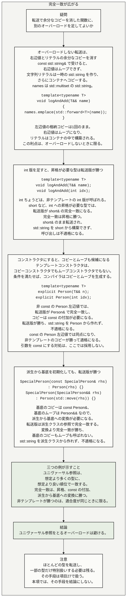

# ユニヴァーサル参照をとるオーバーロードは避ける

```mermaid
%%{init: {'theme':'base','securityLevel':'loose','themeCSS':'svg { background-color: #f4f4f1; } .nodeLabel, .nodeLabel p, .nodeLabel span, .nodeLabel div, .edgeLabel, .edgeLabel span, .edgeLabel p, .edgeLabel tspan, .label { color: #1a1a1a !important; fill: #1a1a1a !important; } .nodeLabel { display: block !important; width: 100% !important; text-align: left !important; } .nodeLabel p, .nodeLabel span, .nodeLabel div { text-align: left !important; } .edgeLabel { background-color: #f4f4f1 !important; } .edgeLabel rect, .labelBkg { fill: #f4f4f1 !important; background-color: #f4f4f1 !important; } .cluster rect { fill: #f4f4f1 !important; } .nodeLabel pre { display: block; width: 100%; margin: 0; text-align: left; background: transparent; border: 0; } .nodeLabel code { color: #1a1a1a !important; background-color: #d2d2d2 !important; display: block; width: 100%; margin: 0; text-align: left; white-space: pre-wrap; font-family: Consolas, monospace; }','flowchart':{'htmlLabels':true,'wrappingWidth':520,'padding':12,'nodeSpacing':32,'rankSpacing':40},'themeVariables':{'background':'#f4f4f1','primaryColor':'#fbfbf8','primaryTextColor':'#1a1a1a','primaryBorderColor':'#1a1a1a','lineColor':'#1a1a1a','secondaryColor':'#fbfbf8','tertiaryColor':'#fbfbf8','textColor':'#1a1a1a','mainBkg':'#fbfbf8','nodeBorder':'#1a1a1a','edgeLabelBackground':'#f4f4f1','nodeTextColor':'#1a1a1a','clusterBkg':'#f4f4f1','clusterBorder':'#1a1a1a','titleColor':'#1a1a1a','fontSize':'16px'}}}%%
flowchart TD
    classDef default fill:#fbfbf8,stroke:#1a1a1a,stroke-width:1.5px,color:#1a1a1a
    classDef claim fill:#e7efe4,stroke:#1a1a1a,stroke-width:1.5px,color:#1a1a1a
    linkStyle default stroke:#1a1a1a,color:#1a1a1a
    subgraph canvas ["完全一致が広がる"]
        direction TB

        open["疑問<br/>転送で余分なコピーを消した関数に、<br/>別のオーバーロードを足してよいか"]
        alone["オーバーロードしない転送は、<br/>右辺値とリテラルの余分なコピーを消す<br/>const std::string&amp; で受けると、<br/>右辺値はムーブできず、<br/>文字列リテラルは一時の std::string を作り、<br/>さらにコンテナへコピーする。<br/>names は std::multiset の std::string。<pre><code>template&lt;typename T&gt;<br/>void logAndAdd(T&amp;&amp; name)<br/>{<br/>  names.emplace(std::forward&lt;T&gt;(name));<br/>}</code></pre>左辺値の格納コピーは1回のまま。<br/>右辺値はムーブになり、<br/>リテラルはコンテナの中で構築される。<br/>この利点は、オーバーロードしないときに限る。"]
        shortCase["int 版を足すと、昇格が必要な型は転送版が勝つ<pre><code>template&lt;typename T&gt;<br/>void logAndAdd(T&amp;&amp; name);<br/>void logAndAdd(int idx);</code></pre>int ちょうどは、非テンプレートの int 版が呼ばれる。<br/>short など、int への昇格が必要な型では、<br/>転送版が short&amp; の完全一致になる。<br/>完全一致は昇格に勝つ。<br/>short&amp; のまま転送され、<br/>std::string を short から構築できず、<br/>呼び出しは不適格になる。"]
        ctorCase["コンストラクタにすると、コピーとムーブも候補になる<br/>テンプレートコンストラクタは、<br/>コピーコンストラクタでもムーブコンストラクタでもない。<br/>条件を満たせば、コンパイラはコピーとムーブを生成する。<pre><code>template&lt;typename T&gt;<br/>explicit Person(T&amp;&amp; n);<br/>explicit Person(int idx);</code></pre>非 const の Person 左辺値では、<br/>転送版が Person&amp; で完全一致し、<br/>コピーは const の付加が必要になる。<br/>転送版が勝ち、std::string を Person から作れず、<br/>不適格になる。<br/>const の Person 左辺値では同点になり、<br/>非テンプレートのコピーが勝って適格になる。<br/>引数を const にする対処は、ここでは採用しない。"]
        derivedCase["派生から基底を初期化しても、転送版が勝つ<pre><code>SpecialPerson(const SpecialPerson&amp; rhs)<br/>  : Person(rhs) {}<br/>SpecialPerson(SpecialPerson&amp;&amp; rhs)<br/>  : Person(std::move(rhs)) {}</code></pre>基底のコピーは const Person&amp;、<br/>基底のムーブは Person&amp;&amp; なので、<br/>派生から基底への変換が必要になる。<br/>転送版は派生クラスの参照で完全一致する。<br/>変換より完全一致が勝ち、<br/>基底のコピーもムーブも呼ばれない。<br/>std::string を派生クラスから作れず、不適格になる。"]
        claim["三つの例が示すこと<br/>ユニヴァーサル参照は、<br/>想定より多くの型に、<br/>想定より良い順位で一致する。<br/>完全一致は、昇格、const の付加、<br/>派生から基底への変換に勝つ。<br/>非テンプレートが勝つのは、適合度が同じときに限る。"]
        conclusion["結論<br/>ユニヴァーサル参照をとるオーバーロードは避ける。"]
        caveat["注意<br/>ほとんどの型を転送し、<br/>一部の型だけ特別扱いする必要は残る。<br/>その手段は項目27で扱う。<br/>本項では、その手段を結論にしない。"]

        open --> alone --> shortCase --> ctorCase --> derivedCase --> claim --> conclusion --> caveat
    end
    style canvas fill:#f4f4f1,stroke:#1a1a1a,color:#1a1a1a
    class claim,conclusion claim
```
