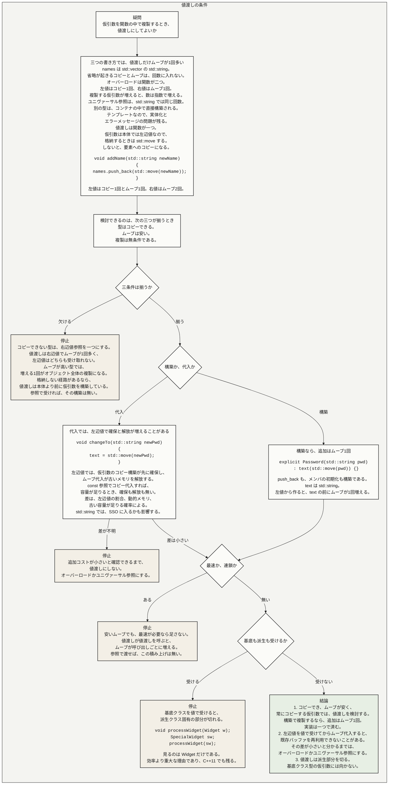

# コピー可能仮引数のムーブコストが安く、かつ常にコピーする場面では値渡しを検討する

```mermaid
%%{init: {'theme':'base','securityLevel':'loose','themeCSS':'svg { background-color: #f4f4f1; } .nodeLabel, .nodeLabel p, .nodeLabel span, .nodeLabel div, .edgeLabel, .edgeLabel span, .edgeLabel p, .edgeLabel tspan, .label { color: #1a1a1a !important; fill: #1a1a1a !important; } .nodeLabel { display: block !important; width: 100% !important; text-align: left !important; } .nodeLabel p, .nodeLabel span, .nodeLabel div { text-align: left !important; } .edgeLabel { background-color: #f4f4f1 !important; } .edgeLabel rect, .labelBkg { fill: #f4f4f1 !important; background-color: #f4f4f1 !important; } .cluster rect { fill: #f4f4f1 !important; } .nodeLabel pre { display: block; width: 100%; margin: 0; text-align: left; background: transparent; border: 0; } .nodeLabel code { color: #1a1a1a !important; background-color: #d2d2d2 !important; display: block; width: 100%; margin: 0; text-align: left; white-space: pre-wrap; font-family: Consolas, monospace; }','flowchart':{'htmlLabels':true,'wrappingWidth':480,'padding':12,'nodeSpacing':36,'rankSpacing':44},'themeVariables':{'background':'#f4f4f1','primaryColor':'#fbfbf8','primaryTextColor':'#1a1a1a','primaryBorderColor':'#1a1a1a','lineColor':'#1a1a1a','secondaryColor':'#fbfbf8','tertiaryColor':'#fbfbf8','textColor':'#1a1a1a','mainBkg':'#fbfbf8','nodeBorder':'#1a1a1a','edgeLabelBackground':'#f4f4f1','nodeTextColor':'#1a1a1a','clusterBkg':'#f4f4f1','clusterBorder':'#1a1a1a','titleColor':'#1a1a1a','fontSize':'16px'}}}%%
flowchart TD
    classDef default fill:#fbfbf8,stroke:#1a1a1a,stroke-width:1.5px,color:#1a1a1a
    classDef stop fill:#f3efe6,stroke:#1a1a1a,stroke-width:1.5px,color:#1a1a1a
    classDef claim fill:#e7efe4,stroke:#1a1a1a,stroke-width:1.5px,color:#1a1a1a
    linkStyle default stroke:#1a1a1a,color:#1a1a1a
    subgraph canvas ["値渡しの条件"]
        direction TB

        open["疑問<br/>仮引数を関数の中で複製するとき、<br/>値渡しにしてよいか"]
        compare["三つの書き方では、値渡しだけムーブが1回多い<br/>names は std::vector の std::string。<br/>省略が起きるコピーとムーブは、回数に入れない。<br/>オーバーロードは関数が二つ。<br/>左値はコピー1回、右値はムーブ1回。<br/>複製する仮引数が増えると、数は指数で増える。<br/>ユニヴァーサル参照は、std::string では同じ回数。<br/>別の型は、コンテナの中で直接構築される。<br/>テンプレートなので、実体化と<br/>エラーメッセージの問題が残る。<br/>値渡しは関数が一つ。<br/>仮引数は本体では左辺値なので、<br/>格納するときは std::move する。<br/>しないと、要素へのコピーになる。<pre><code>void addName(std::string newName)<br/>{<br/>  names.push_back(std::move(newName));<br/>}</code></pre>左値はコピー1回とムーブ1回。右値はムーブ2回。"]
        need["検討できるのは、次の三つが揃うとき<br/>型はコピーできる。<br/>ムーブは安い。<br/>複製は無条件である。"]
        gate{"三条件は揃うか"}
        stopGate["停止<br/>コピーできない型は、右辺値参照を一つにする。<br/>値渡しは右辺値でムーブが1回多く、<br/>左辺値はどちらも受け取れない。<br/>ムーブが高い型では、<br/>増える1回がオブジェクト全体の複製になる。<br/>格納しない経路があるなら、<br/>値渡しは本体より前に仮引数を構築している。<br/>参照で受ければ、その構築は無い。"]
        how{"構築か、代入か"}
        construct["構築なら、追加はムーブ1回<pre><code>explicit Password(std::string pwd)<br/>  : text(std::move(pwd)) {}</code></pre>push_back も、メンバの初期化も構築である。<br/>text は std::string。<br/>左値から作ると、text の前にムーブが1回増える。"]
        assign["代入では、左辺値で確保と解放が増えることがある<pre><code>void changeTo(std::string newPwd)<br/>{<br/>  text = std::move(newPwd);<br/>}</code></pre>左辺値では、仮引数のコピー構築が先に確保し、<br/>ムーブ代入が古いメモリを解放する。<br/>const 参照でコピー代入すれば、<br/>容量が足りるとき、確保も解放も無い。<br/>差は、左辺値の割合、動的メモリ、<br/>古い容量が足りる確率による。<br/>std::string では、SSO に入るかも影響する。"]
        stopAssign["停止<br/>追加コストが小さいと確認できるまで、<br/>値渡しにしない。<br/>オーバーロードかユニヴァーサル参照にする。"]
        rest{"最速か、連鎖か"}
        stopRest["停止<br/>安いムーブでも、最速が必要なら足さない。<br/>値渡しが値渡しを呼ぶと、<br/>ムーブが呼び出しごとに増える。<br/>参照で渡せば、この積み上げは無い。"]
        slice{"基底も派生も受けるか"}
        stopSlice["停止<br/>基底クラスを値で受けると、<br/>派生クラス固有の部分が切れる。<pre><code>void processWidget(Widget w);<br/>SpecialWidget sw;<br/>processWidget(sw);</code></pre>見るのは Widget だけである。<br/>効率より重大な理由であり、C++11 でも残る。"]
        conclusion["結論<br/>1. コピーでき、ムーブが安く、<br/>常にコピーする仮引数では、値渡しを検討する。<br/>構築で複製するなら、追加はムーブ1回。<br/>実装は一つで済む。<br/>2. 左辺値を値で受けてからムーブ代入すると、<br/>既存バッファを再利用できないことがある。<br/>その差が小さいと分かるまでは、<br/>オーバーロードかユニヴァーサル参照にする。<br/>3. 値渡しは派生部分を切る。<br/>基底クラス型の仮引数には向かない。"]

        open --> compare --> need --> gate
        gate -->|"欠ける"| stopGate
        gate -->|"揃う"| how
        how -->|"構築"| construct
        how -->|"代入"| assign
        assign -->|"差が不明"| stopAssign
        assign -->|"差は小さい"| rest
        construct --> rest
        rest -->|"ある"| stopRest
        rest -->|"無い"| slice
        slice -->|"受ける"| stopSlice
        slice -->|"受けない"| conclusion
    end
    style canvas fill:#f4f4f1,stroke:#1a1a1a,color:#1a1a1a
    class stopGate,stopAssign,stopRest,stopSlice stop
    class conclusion claim
```
