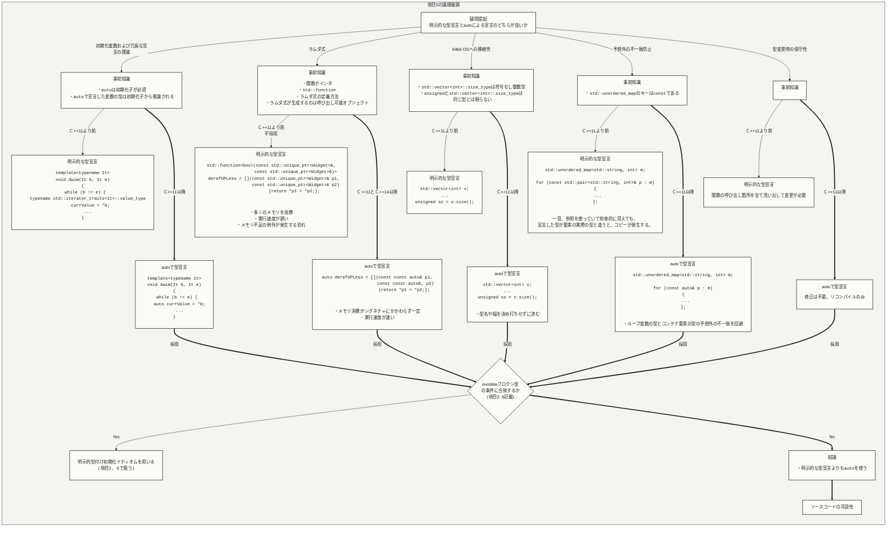

# 型を明示する理由がなければ auto を使う

```mermaid
%%{init: {'theme':'base','themeCSS':'svg { background-color: #f4f4f1; } .nodeLabel pre { display: block; width: 100%; margin: 0; text-align: left; background: transparent; border: 0; } .nodeLabel code { color: rgb(26,26,26) !important; background-color: rgb(210,210,210) !important; display: block; width: 100%; margin: 0; text-align: left; }','flowchart':{'htmlLabels':true,'wrappingWidth':720},'themeVariables':{'background':'#f4f4f1','primaryColor':'#fbfbf8','primaryTextColor':'#1a1a1a','primaryBorderColor':'#1a1a1a','lineColor':'#1a1a1a','secondaryColor':'#fbfbf8','tertiaryColor':'#fbfbf8','textColor':'#1a1a1a','mainBkg':'#fbfbf8','nodeBorder':'#1a1a1a','edgeLabelBackground':'#f4f4f1','nodeTextColor':'#1a1a1a','clusterBkg':'#f4f4f1','clusterBorder':'#1a1a1a','titleColor':'#1a1a1a'}}}%%
flowchart TD
    classDef default fill:#fbfbf8,stroke:#1a1a1a,stroke-width:1.5px,color:#1a1a1a
    linkStyle default stroke:#1a1a1a,color:#1a1a1a
    subgraph canvas ["項目5の論理展開"]
        direction TD

        open -- 初期化変数および冗長な宣言の撲滅 --> prerequisite1 -- "Ｃ++11より前" --> cppp11_1
                                                  prerequisite1 == "Ｃ++11以降" ===> auto_1 == "採用" ==>  ExceptionCondition
        open -- ラムダ式 --> prerequisite2 -- "Ｃ++11より前<br/>不採用" --> cppp11_2
                            prerequisite2 == "Ｃ++11とＣ++14以降" ===> auto_2 == "採用" ==>  ExceptionCondition       
        open -- 64bit OSへの移植性 --> prerequisite3 -- "Ｃ++11より前" --> cppp11_3
                                      prerequisite3 =="Ｃ++11以降" ===> auto_3 == "採用"==> ExceptionCondition
        open -- 予想外の不一致防止 --> prerequisite4 -- "Ｃ++11より前" --> cppp11_4
                                      prerequisite4 == "Ｃ++11以降" ===> auto_4 == "採用" ==> ExceptionCondition
        open -- 型変更時の保守性 --> prerequisite5 -- "Ｃ++11より前" --> cppp11_5
                                   prerequisite5 == "Ｃ++11以降" ===> auto_5 == "採用" ==> ExceptionCondition
        ExceptionCondition -- Yes --> Exception
        ExceptionCondition == No ==> Conclusion ==> Notes

        open["疑問提起<br/>明示的な型宣言とautoによる宣言のどちらが良いか"]

        prerequisite1["事前知識<pre>・autoは初期化子が必須<br/>・autoで宣言した変数の型は初期化子から推論される</pre>"]
        prerequisite2["事前知識<pre>・関数ポインタ<br/>・std::function<br/>・ラムダ式の定義方法<br/>・ラムダ式が生成するのは呼び出し可能オブジェクト"]
        prerequisite3["事前知識<pre>・std::vector&lt;int&gt::size_typeは符号なし整数型<br/>・unsignedとstd::vector&lt;int&gt::size_typeは<br/> 同じ型とは限らない"]
        prerequisite4["事前知識<pre>・std::unordered_mapのキーはconstである"]
        prerequisite5["事前知識<pre>"]


        cppp11_1["明示的な型宣言<br/><pre><code>template&lt;typename It&gt;<br/>void dwim(It b, It e)<br/>{<br/>  while (b != e) {<br/>    typename std::iterator_traits&lt;It&gt;::value_type<br/>      currValue = *b;<br/>    ...<br/>}</code></pre>"]
        cppp11_2["明示的な型宣言<br/><pre><code>std::function&lt;bool(const std::unique_ptr&lt;Widget&gt;&amp;,<br/>                   const std::unique_ptr&lt;Widget&gt;&amp;)&gt;<br/>  derefUPLess = [](const std::unique_ptr&lt;Widget&gt;&amp; p1,<br/>                   const std::unique_ptr&lt;Widget&gt;&amp; p2)<br/>                  {return *p1 &lt; *p2;};</code></pre><br/><pre>・多くのメモリを消費<br/>・実行速度が遅い<br/>・メモリ不足の例外が発生する恐れ</pre>"]
        cppp11_3["明示的な型宣言<br/><pre><code>std::vector&lt;int&gt; v;<br/>...<br/>unsigned sz = v.size();</code></pre>"]
        cppp11_4["明示的な型宣言<pre><code>std::unordered_map&ltstd::string, int&gt m;<br/><br/>for (const std::pair&lt;std::string, int&gt;&amp; p : m)<br/>{<br/>  ...<br/>};</code></pre><br/>一見、参照を使っていて効率的に見えても、<br/>宣言した型が要素の実際の型と違うと、コピーが発生する。"]
        cppp11_5["明示的な型宣言<pre>関数の呼び出し箇所を全て洗い出して変更が必要</pre>"]


        auto_1["autoで型宣言<br/><pre><code>template&lt;typename It&gt;<br/>void dwim(It b, It e)<br/>{<br/>  while (b != e) {<br/>    auto currValue = *b;<br/>    ...<br/>}</code></pre>"]
        auto_2["autoで型宣言<br/><pre><code>auto derefUPLess = [](const const auto&amp; p1,<br/>                      const const auto&amp;, p2)<br/>                     {return *p1 &lt; *p2;};</code></pre><br/><pre>・メモリ消費がシグネチャにかかわらず一定<br/>・実行速度が速い</pre>"]
        auto_3["autoで型宣言<br/><pre><code>std::vector&lt;int&gt; v;<br/>...<br/>unsigned sz = v.size();</code></pre><br/>・型名や幅を決め打ちせずに済む"]
        auto_4["autoで型宣言<br/><pre><code>std::unordered_map&ltstd::string, int&gt m;<br/><br/>for (const auto& p : m)<br/>{<br/>  ...<br/>};</code></pre><br/>・ループ変数の型とコンテナ要素の型の予想外の不一致を回避"]
        auto_5["autoで型宣言<br/><pre>修正は不要。リコンパイルのみ</pre>"]


        ExceptionCondition{"invisibleプロクシ型<br/>の条件に合致するか<br/>(項目2, 6記載)"}
        Exception["<pre>明示的型付け初期化イディオムを用いる<br/>(項目2, 6で扱う)"]
        Conclusion["結論<pre>・明示的な型宣言よりもautoを使う"]
        Notes["ソースコードの可読性"]

    end
    style canvas fill:#f4f4f1,stroke:#1a1a1a,color:#1a1a1a
```
